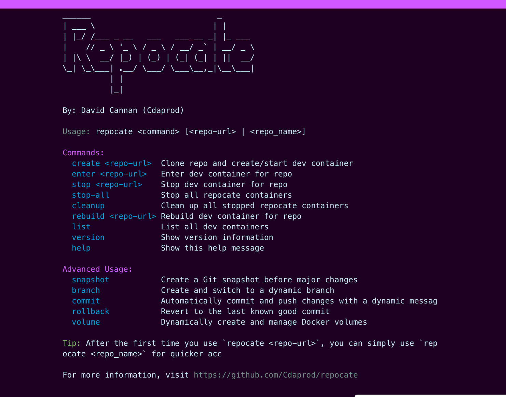
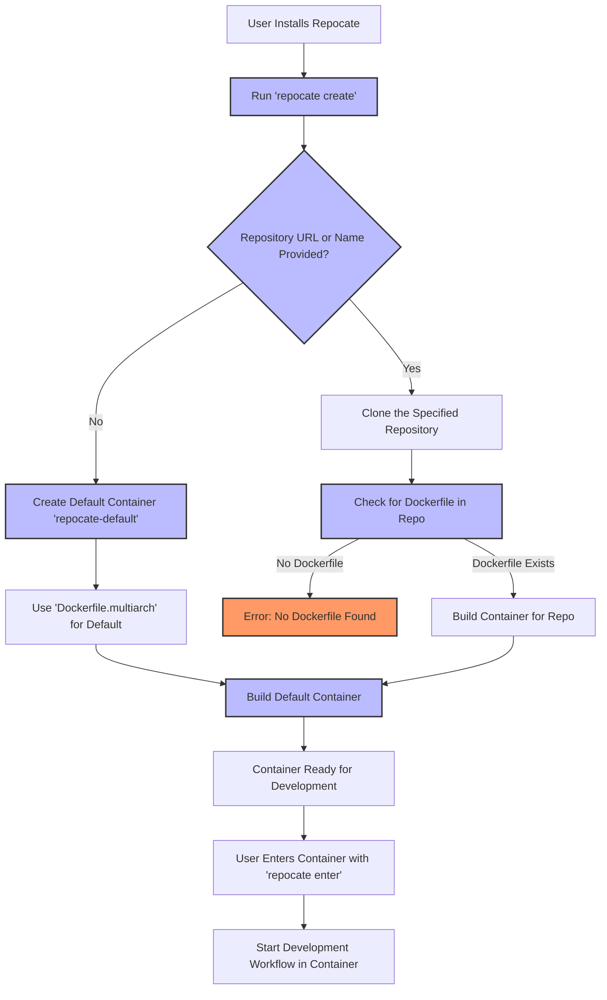

[](https://github.com/Cdaprod/repocate/actions/workflows/repocate-build.yml)

<div align="center">
  
</div>

---

# Repocate: Your Code's Favorite Moving Company! 📦🚚

Ever wish you could pack up your entire dev environment and move it to a new machine faster than you can say "git clone"? Well, pack your bags (or don't, actually), because Repocate is here to do the heavy lifting for you!

Repocate is the turbocharged, no-hassle way to relocate your development setup. It's like having a team of coding movers who know exactly where to put your Node modules and won't ever lose your Go packages in transit.

### With Repocate, you can:

- Clone repos faster than a caffeinated developer types "npm install"
- Spin up dev environments quicker than you can say "Docker run"
- Jump between projects like a ninja hopping across rooftops

No more "It works on my machine" blues. No more spending half your day setting up a new environment. Just pure, unadulterated coding bliss.

So, whether you're a digital nomad hopping between coffee shops or a team lead onboarding new devs, Repocate is your one-way ticket to Productivity City. All aboard the express train to Efficient-ville!

Ready to make your code feel at home anywhere? Let's repocate! 🚀

<div align="center">
  
</div>

---

## User Flow Diagram

The diagram below outlines the typical flow of using `Repocate`, from installation to setting up a development container:



## Overview

**Repocate** is a powerful tool designed to streamline the creation and management of repositories and projects by providing custom, prebuilt, and preconfigured workspace environments. It leverages Docker and GitHub Actions to ensure that every new project starts with a consistent and optimized setup, significantly reducing the time and effort required for initialization.

### Key Features

- **Rapid Repository and Project Initialization:** Quickly spin up new repositories and projects with standardized environments, ensuring consistency across all your development workflows.
  
- **Prebuilt and Preconfigured Environments:** Each workspace comes equipped with essential tools and dependencies, including Go, Node.js, Rust, Zsh with Oh My Zsh, Neovim with plugins, and MetaGPT. This comprehensive setup ensures that developers have everything they need right out of the box.
  
- **Multi-Architecture Support:** Built with versatility in mind, Repocate supports multiple architectures (e.g., `amd64`, `arm64`) through Docker Buildx and QEMU emulation. This ensures compatibility across a wide range of hardware and deployment targets.
  
- **Efficient Caching Mechanism:** Utilizing Docker Buildx caching and GitHub Actions artifacts, Repocate optimizes build times and resource usage, making multi-arch builds faster and more efficient.
  
- **Automated Build and Deployment:** Integrated GitHub Actions workflows automate the building, caching, and pushing of Docker images. This automation guarantees that the latest configurations and tools are always available for new projects without manual intervention.
  
- **Consistent Development Environments:** By standardizing the development environment, Repocate minimizes the "it works on my machine" syndrome, fostering better collaboration and reducing configuration-related issues.
  
- **Extensibility and Customization:** While Repocate provides a robust default setup, it is highly customizable. Teams can easily extend or modify the base image to include additional tools or configurations as needed, ensuring that the environment adapts to evolving project requirements.

### How It Works

1. **Docker-Based Environment Setup:** At the core of Repocate is a meticulously crafted Dockerfile that installs all necessary tools and dependencies. This Dockerfile is designed to handle multiple architectures by dynamically downloading and configuring binaries based on the target platform.

2. **GitHub Actions Integration:** Repocate employs GitHub Actions workflows to automate the building and caching of Docker images. The workflows are configured to support multi-architecture builds, leveraging Docker Buildx and QEMU for emulation. This ensures that images are built efficiently and pushed to DockerHub with the appropriate multi-arch manifests.

3. **Caching Strategy:** To optimize build times, Repocate utilizes caching mechanisms for both Go modules and Docker layers. By caching these components, subsequent builds can reuse existing layers, drastically reducing the time required to build images from scratch.

4. **Automated Deployment:** Upon pushing changes or creating new tags, the GitHub Actions workflows automatically trigger the build and deployment processes. This seamless automation ensures that the latest environment configurations are always available and up-to-date.

### Benefits

- **Consistency Across Projects:** Ensure that every project adheres to the same development standards and configurations, promoting uniformity and reducing onboarding time for new team members.
  
- **Time and Resource Efficiency:** By automating the setup and leveraging caching, Repocate minimizes the overhead associated with environment configuration, allowing developers to focus more on writing code and less on setup tasks.
  
- **Scalability:** Whether you're managing a single project or multiple repositories, Repocate scales effortlessly, maintaining consistent environments across all your development efforts.
  
- **Flexibility:** The ability to customize and extend the base environment means that Repocate can adapt to a wide range of project requirements, making it suitable for diverse development scenarios.
  
- **Enhanced Collaboration:** With standardized environments, team members can collaborate more effectively, reducing discrepancies and ensuring that everyone is working within the same setup.

### Getting Started

Repocate is designed to integrate seamlessly into your existing workflow. By following the setup instructions, you can start leveraging its capabilities to enhance your development process, ensuring that every new project is equipped with a robust and reliable environment from the get-go.

---

By incorporating Repocate into your development toolkit, you empower your teams to work more efficiently, maintain consistency across projects, and reduce the complexities associated with environment setup and management. Embrace the simplicity and power of Repocate to elevate your development workflows to the next level.

### Quick Explanation:

1. **Installation**: Install `Repocate` on your system.
2. **Create**: Run `repocate create` with or without a repository URL.
3. **Clone or Default**: If a repository is provided, it's cloned; otherwise, a default container is created.
4. **Build**: A container is built using the repository's Dockerfile or a default multi-architecture Dockerfile.
5. **Develop**: Enter the container with `repocate enter` and start your development workflow.

---

## Features

- **Containerized Development**: Consistent, reproducible environments in Docker.
- **Dynamic Management**: Handles ports and volumes intelligently.
- **Version Control Integration**: Automatically version and tag containers.
- **Custom Plugins**: Tailor your environment with Zsh and Neovim configurations.
- **Snapshot & Rollback**: Safeguard your progress with Git snapshots and easy rollbacks.
- **Flexible Configuration**: Customize your `.zshrc` and Neovim settings.

## Usage

1. **Create a Development Container:**

   ```sh
   repocate create <repo-url>
   ```

2. **Enter the Container:**

   ```sh
   repocate enter <repo-url> or <repo_name>
   ```

3. **Stop the Container:**

   ```sh
   repocate stop <repo-url>
   ```

4. **Rebuild the Container:**

   ```sh
   repocate rebuild <repo-url>
   ```

5. **List All Containers:**

   ```sh
   repocate list
   ```

6. **Advanced Usage:**

   - **Snapshot:** `repocate snapshot` to create a Git snapshot.
   - **Rollback:** `repocate rollback` to revert to the last known good commit.
   - **Volume Management:** Use `repocate volume` for dynamic volume management.

## Getting Started

1. **Install Repocate:**

   Clone the repository and run the following commands:

   ```sh
   git clone https://github.com/cdaprod/repocate.git
   cd repocate
   make install
   ```

2. **Configure Your Environment:**

   Customize your environment via configuration files located in `~/.config/repocate/`.

3. **Build Docker Images:**

   Leverage the provided GitHub Actions workflows to manage image builds, port assignments, and versioning.

## Contributing

We welcome contributions! Here's how you can help:

1. Fork the repository.
2. Create a feature branch (`git checkout -b feature/your-feature`).
3. Commit your changes (`git commit -m 'Add some feature'`).
4. Push to the branch (`git push origin feature/your-feature`).
5. Open a Pull Request.

## License

Repocate is licensed under the MIT License. See the `LICENSE` file for more information.

## Support

Encounter issues or have questions? Open an issue on GitHub or reach out to the maintainer at cdaprod@cdaprod.dev